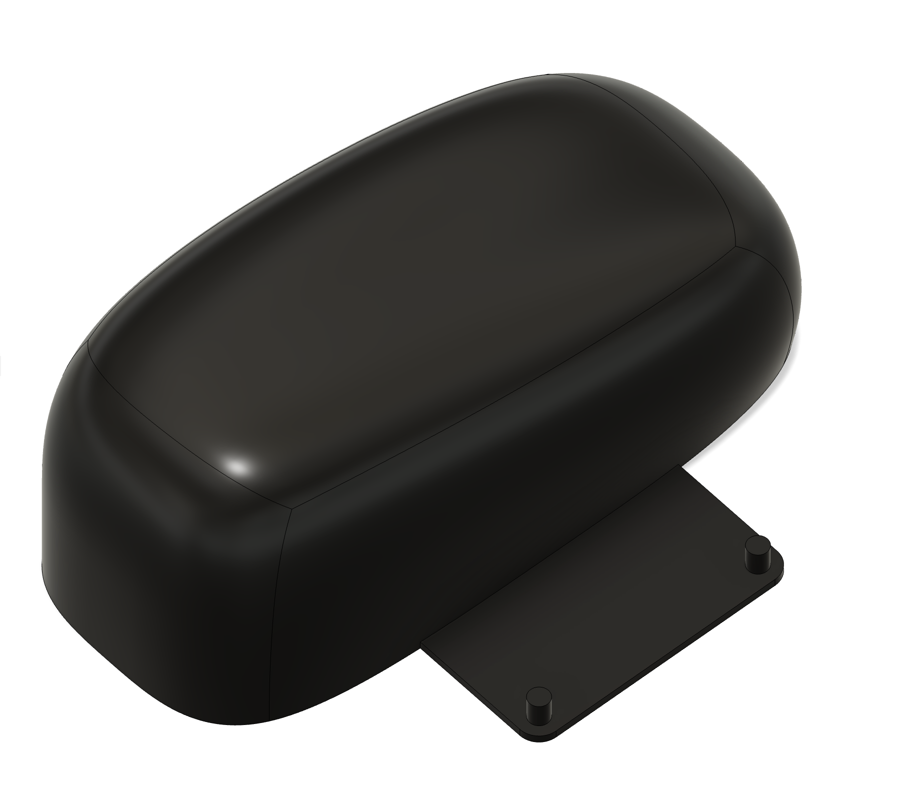
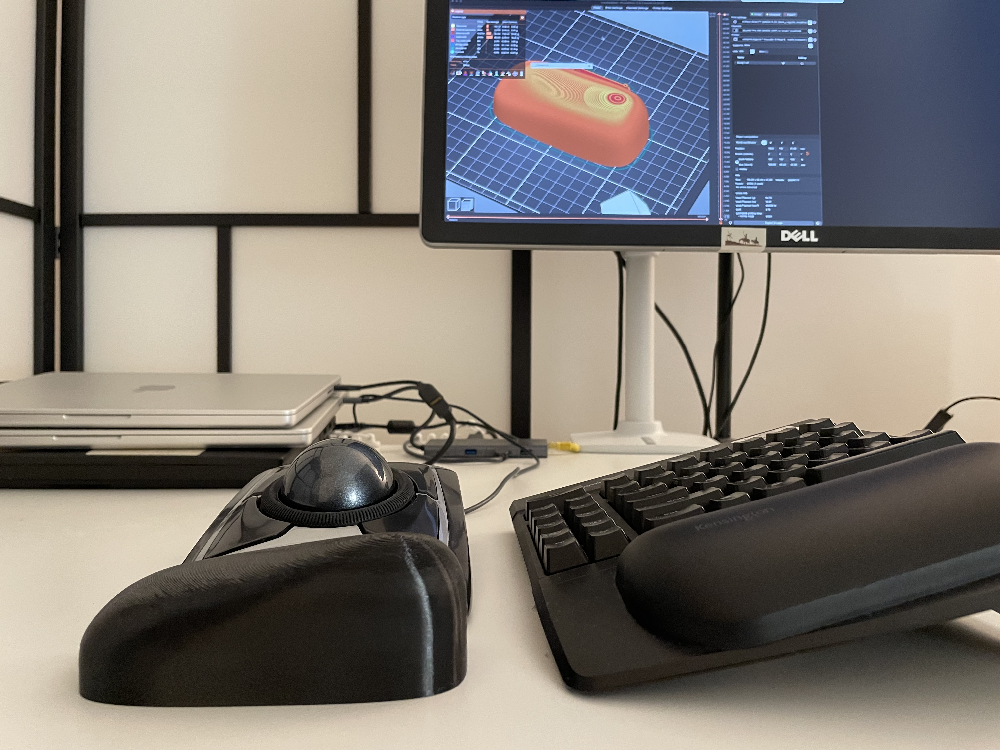
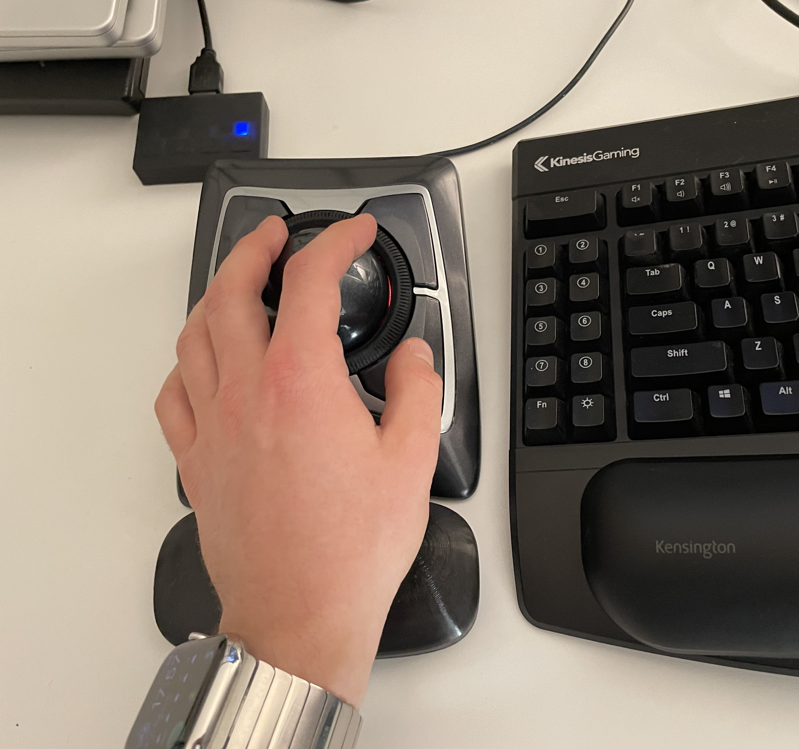
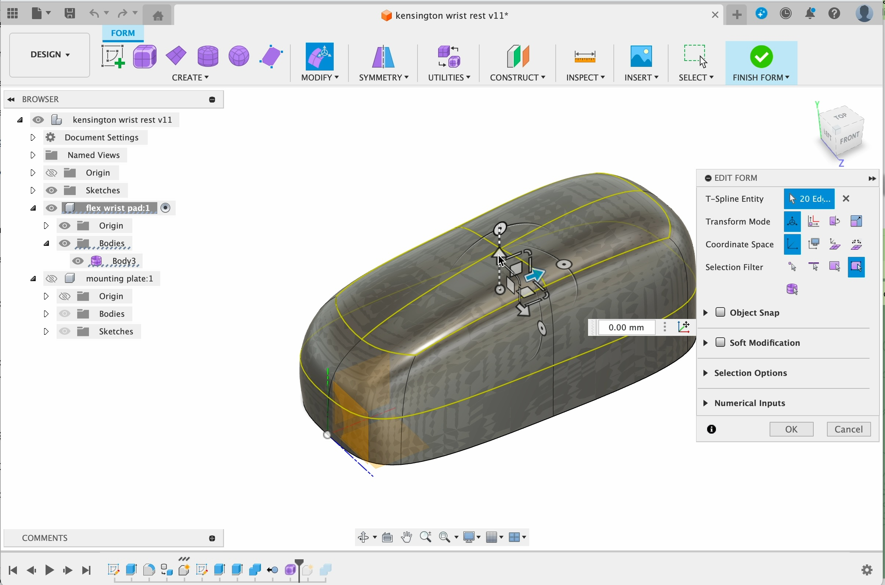
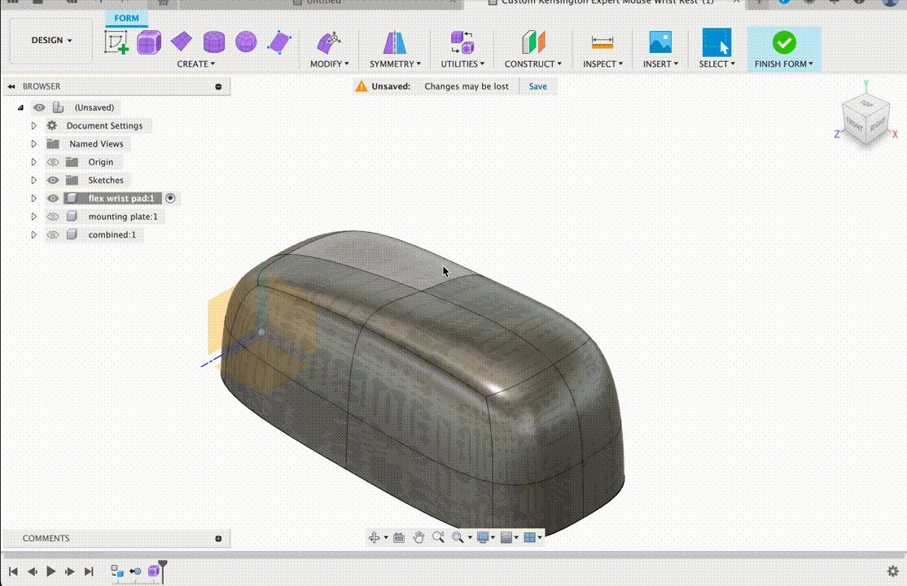
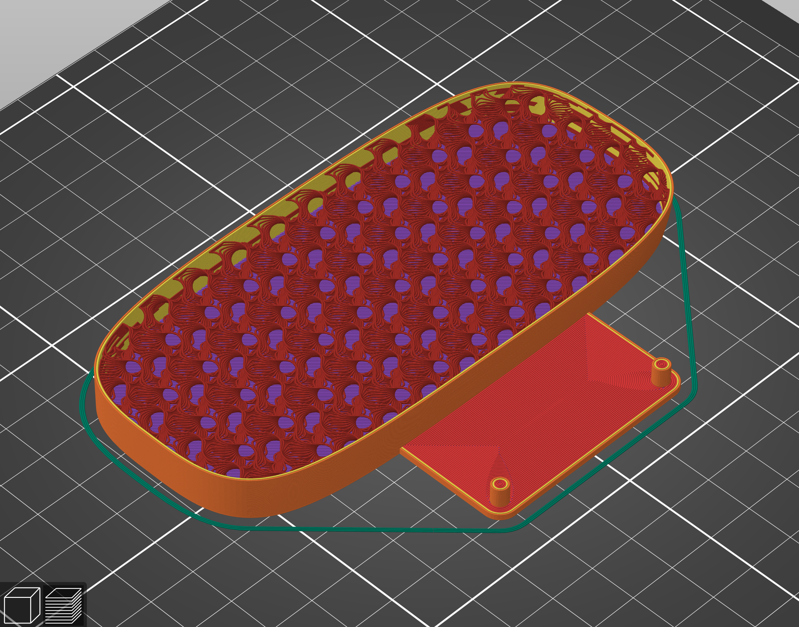

# Customizable 3D printed wrist rest for Kensington Expert Mouse trackball

[**Download, comment and like on Printables.com**](https://www.printables.com/model/942199-customizable-kensington-expert-mouse-wrist-rest)

The wrist rest that came with my Kensington Expert Mouse broke, 
so I designed and 3D printed my own.

## Customizing

The version in the repository is made to fit the angle of the left half
Kinesis Freestyle Edge keyboard with the Lift Kit installed at max height
and pretty thick store-bought Kensington gel wrist pads. 

If you use a similar combination of keyboard, wrist rest, and hand,
then you can skip this section and move to printing :)
Otherwise you may need to modify the files to your own setup.

If you prefer to use only the mounting pegs, for a different wrist pad
made out of gel, wood, epoxy resin, concrete or anything else - 
you can simply remove the "flex wrist pad" component and build your base plate
around the "mounting plate" component.

To customize the wrist pad shape, open the included [.f3d file](./Custom%20Kensington%20Expert%20Mouse%20Wrist%20Rest.f3d)
in Autodesk Fusion, and edit the form body (right click the purple box on timeline -> Edit).

Use Modify tool from the Form palette to shape the form to your liking.
After you're done, create an STL from the "combined" component body (it should
update itself after modifying the form and accepting the changes with Done)

## Printing

I sliced the STL from Fusion with PrusaSlicer. 3MF file is included
so that you can compare the settings.

The finished version was printed with 2 perimeter walls with 10% gyroid infill
for the nice squishy feel. This is a matter of personal preference and
the filament used. I used [3DJake TPU A95 in black](https://www.3djake.com/3djake/tpu-a95-black) 
(not sponsored). Use "Archimedean Chords" or "Concentric" top infill for nice finish.

My printer at the time was an Anycubic i3 Mega-S with the default Bowden setup, 
so the printer settings (25 mm/s all speeds, no retract, etc.) may not be 
applicable to nicer models. If you have printed flexibles on your machine before,
use your judgement and experience!

